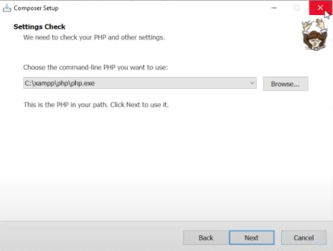
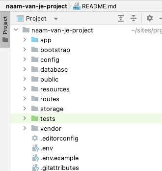
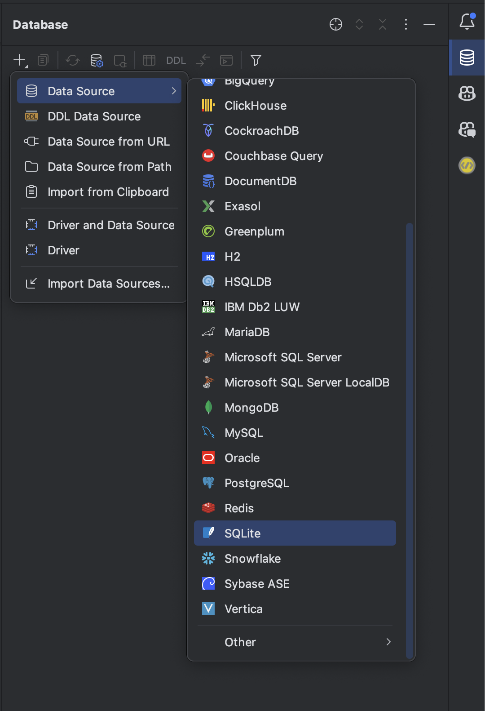

# Installatieproces

Er wordt vanuit gegaan dat [Composer](https://getcomposer.org/doc/00-intro.md) geïnstalleerd is. Ook is het aan te raden deze stappen te volgen en geen gebruik te maken van Docker of Homestead. Deze tools zijn handig als je op je machine meerdere versies van PHP naast elkaar wilt draaien met verschillende versies van Laravel, maar voor de scope van dit vak overkill. 

Bij de installatie van Composer kan je composer naar de PHP installatie van Xampp laten verwijzen. Voordeel is dat alle extensies die je nodig hebt al aanstaan. 



## Project aanmaken

Met het volgende command in de Terminal maak je een nieuw project aan op de locatie waar je op dat moment staat (bijv. `Documenten/jaar2/programmeren5`). Kies niet voor een locatie in htdocs, dit geeft problemen met rechten zoals images uploaden. Daarnaast is het niet verstandig om bij het aanmaken van een nieuw Laravel-project een locatie in je OneDrive te kiezen. Een Laravel-project kan veel bestanden bevatten die allemaal gesynchroniseerd gaan worden. Het is ook niet nodig omdat je het project gaat toevoegen aan GIT. Kies een andere map (gewoon op c:/ ) waar je dit soort projecten opslaat. 

```bash
composer create-project laravel/laravel naam-van-je-project
```

Na het uitvoeren van het commando wordt in de map waar je staat een nieuwe folder gemaakt met de naam: **naam-van-je-project**

Open deze map in PHPStorm. Let erop dat de map met die naam de eerste folder is die je ziet in het overzicht van het project in PHPStorm.



## Database

Bij het aanmaken van een nieuw project wordt er ook direct een database aangemaakt in de vorm van SQLite. Dit is een database dat in een bestand wordt opgeslagen en waar geen databaseserver voor nodig is zoals bij MySQL of MariaDB.

Om in de database te kunnen 'kijken' of bewerkingen te kunnen doen, kun je deze toevoegen als datasource in PHPStorm. Klik in PHPStorm op het database icoontje in de rechterbovenhoek.

Klik op het plusje en kies voor SQLite. Selecteer het bestand `database/database.sqlite` in je projectfolder.

De database wordt toegevoegd en je kunt de tabellen bekijken onder _database.sqlite > main > tables_. Dubbelklik op de tabel om de inhoud te bekijken.


### Projectsettings

Een laravel project heeft een aantal basisinstellingen die je kunt vinden in het `.env` bestand. Dit bestand bevat bijvoorbeeld de (login)gegevens van de database. Dit bestand mag je niet toevoegen aan je repository omdat hier gevoelige informatie in staat. Daarom staat het standaard in de `.gitignore` file. 
Open het `.env` bestand en verander de `APP_NAME`

```bash
# Algemeen
APP_NAME=projectnaam # bedenk hier zelf een passende naam
APP_ENV=local
APP_KEY=base64:AvFlHWzYakMYu4UiGqrn8FzYXxfR3hzm3wgDY2k74= #Dit wordt gegenereerd
APP_DEBUG=true
APP_URL=http://localhost

# database
# De basisgegevens voor de database staan goed voor local development
DB_CONNECTION=sqlite
# DB_HOST=127.0.0.1
# DB_PORT=3306
# DB_DATABASE=laravel
# DB_USERNAME=root
# DB_PASSWORD=
```

## Development server starten

Om het resultaat van het Laravel project in de browser te kunnen zien, heb je een php server nodig. Deze wordt meegeleverd in het Laravel project en is met een commando in de **terminal** te starten

```bash
php artisan serve
```

De server wordt gestart en het url wordt weergegeven in de terminal. Met CTRL / CMD + click kun je het url openen in je browser.

Als het goed is zie je nu de default startpagina van Laravel.

**Gefeliciteerd, de installatie is geslaagd!**

## Laravel Idea Plugin
Gratis bonus tip! Maak gebruik van de Laravel Idea Plugin voor PhpStorm. Deze plugin zorgt voor extra functionaliteit in PhpStorm 
die specifiek voor Laravel is.
[Aanvragen licentie voor Laravel Idea plugin](laravelidea.md)
