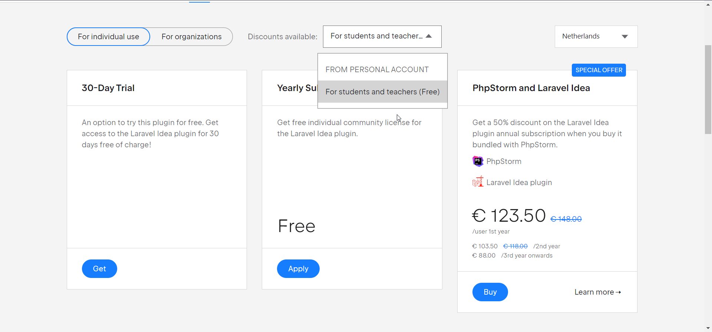

## Laravel plugin

Tijdens de ontwikkeling van het project is het erg fijn om de **Laravel Idea plugin** te gebruiken. Deze moet je apart installeren in PHPStorm en als student kun je deze gratis gebruiken zolang je een student license hebt.

Om deze te installeren ga je naar de Settings (**PhpStorm | Settings** voor macOS of **File | Settings** voor Windows)

Klik op ****************Plugins.**************** Klik in het midden op **Marketplace** en zoek op “*Laravel”*

Klik op Install bij de Laravel Idea plugin.

Wanneer je in het bezit bent van een [Jetbrains account met student license](https://www.jetbrains.com/shop/eform/students/), heb je ook gratis toegang tot deze plugin. Je zal het alleen wel moeten activeren.

Bij de installatie van de plugin zie je ook de link naar de [Plugin Homepage](https://plugins.jetbrains.com/plugin/13441-laravel-idea/pricing#edition=personal&tabs). Zorg dat je ingelogd bent op de webpagina met je Jetbrains account. Klik op de blauwe GET button of scroll naar beneden. Naast de knop met *For individual use / For organisation* zie je een dropdown met *Discounts available*. Kies hier voor de optie *For students.*

Hierna zie je dat de yearly subscription gratis wordt. En klik hier op apply.

Hierna kan je in PHPStorm op *Refresh* klikken bij de plugin (of PHPStorm opnieuw opstarten). De plugin is nu geactiveerd.