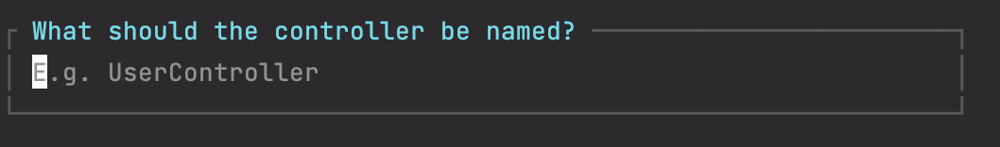

# New Project with Route and Controller

## create new project

- create new project via terminal (composer has to be installed)

    ```bash
    composer create-project laravel/laravel example-app
    ```

- Open project in PHPStorm

    ```bash
    php artisan serve
    ```

## route (and first view)

- Open `web.php`
- Explain first route.
- Create about us route, with view.
    - First create route without the page.

    ```php
    Route::get('/about-us', function() {
        return 'About us';
    });
    ```

- Show return with HTML.
- replace return with *`return* view('about-us');`
- create view through context menu
- show linking to view (CMD + Click). Add tag and use lorem + tab.

## Create new Controller

- Open the terminal

    ```bash
    php artisan make:controller
    ```

  
    *Use Upper Camel Case for the name because this is a Class file.*

- *AboutUsController*
- Choose **Empty** controller.

**Edit AboutUsController**

- Open /app/Https/Controllers/AboutUsController
- Create index() method
- return ‘Test’
- Create route `Route::get('/test', [AboutUsController::*class*, 'index']);`

## **Create resource Controller**

- in terminal `php artisan make:controller`
- name: *ProductController*
- type: choose **Resource**
- model **empty** (for now)

  Alter index method

    ```php
    public function index()
    {
        return view('products.index');
    }
    ```

- Create a view and add HTML (ALT + Enter)
- Go to [localhost:8000/products](http://localhost:8000/products) *(why does it show a 404?)*

  **Add resource routes**

    ```php
    Route::resource('products', ProductController::class);
    ```


## **Add parameter to route**

If you want to pass extra information through a route like: https://localhost:8000/products/macbook, where "macbook" is 
the extra information you want to pass. You can do this by adding a parameter to the route.

- create route with `{ }` for query string parameters
    ```php
    Route::get('products/{name}', [ProductController::class, 'show']);
    ```
- Create the method with the parameter with the same parameter name

    ```php
    public function show($name) {
            return view('products.show', compact('name'));
        }
    ```

- Show the name variable in the view

    ```html
    <body>
        <h2>Welkom {{$name}}</h2>
    </body>
    ```


Resource routes have [parameters](https://laravel.com/docs/10.x/controllers#actions-handled-by-resource-controller) build in by default

## Laravel Idea Plugin
[Aanvragen licentie voor Laravel Idea plugin](laravelidea.md)
