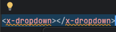

# Components

Er wordt vanuit gegaan dat je de instructie van de [Laracast video's](https://laracasts.com/series/30-days-to-learn-laravel-11/) 
Episode 2 + 3 hebt gevolgd en al een `Component` hebt aangemaakt.

<div style="background-color: dimgray; border: 1px solid black; padding: 10px">
📌 Wist je dat je in PHPStorm makkelijk een nieuw component kunt aanmaken? 
Wanneer je in de view de naam van een nieuw te maken component typt, dan verschijnt het lampje. 



Hiermee kan je het context-menu openen. Dit kan ook door op de naam van het component te gaan staan en de shortcut 
ALT + ENTER te gebruiken. Hier heb je 2 opties: 

1. Create Blade Component (Blade file only)
2. Create Blade Component (Class and Blade file)

De eerste optie maakt de components folder aan (als deze er nog niet is) `resources/views/components` en maakt 
vervolgens een nieuw bestand aan met de naam van het component. Dit gebruik je in de meeste gevallen. Deze `components`
folder is de standaard locatie voor components.

De tweede optie maakt ook een nieuwe Class aan in de Components folder (`app/View/Components`). Dit is handig als je 
een component wilt maken die meer functionaliteit heeft dan alleen een view en/of als je een custom locatie wilt 
gebruiken voor je component. Bijvoorbeeld `resources/views/layouts/app.blade.php`
</div>

Na de instructie van de [Laracast video's](https://laracasts.com/series/30-days-to-learn-laravel-11/) heb je de
volgende opzet.

_Homepagina_
```html
<x-layout>
    <h1>Welcome to the home page</h1>

    <nav>
        <ul>
            <x-navlink>Home</x-navlink>
            <x-navlink>About</x-navlink>
            <x-navlink>Contact</x-navlink>
        </ul>
    </nav>
</x-layout>
```

_Nav link Component_
```html
<li><a href="/">{{$slot}}</a></li>
```

Je hebt al een eerste component aangemaakt voor de standaard layout van elke pagina. Hierdoor
is de Homepagina een stuk overzichtelijker geworden en deze bevat alleen de content die 
specifiek is voor deze pagina.
Op dit moment linken de drie links uit de layout naar de 'welcome' pagina, omdat in het component voor elke
link dezelfde `href` is opgenomen. 

Je kunt informatie aan Componenten doorgeven op meerdere manieren. 

### 1. Als attribuut.

Op de Homepagina maak je een attribuut aan en deze geef je een naam
```html
<ul>
    <x-navlink link="/home">Home</x-navlink>
    <x-navlink link="/about">About</x-navlink>
    <x-navlink link="/contact">Contact</x-navlink>
</ul>
```

In het Component wordt deze data automatisch vertaald naar een variabele
```php
<li><a href="{{ $link }}">{{$slot}}</a></li>
```

⚠️ Nadeel van deze aanpak in dit geval is dat elke `<x-navlink>` tag het attribuut moet hebben, anders ontstaat 
er een error

### Doorgeven van PHP-code
Stel, je wilt niet een string doorgeven, zoals hierboven, maar een variabele (of een PHP-expressie). Dan zal je 
een `:` voor het attribuut moeten zetten. Laravel weet dan dat het onderdeel tussen haakjes eerst geëvalueerd
moet worden door PHP. 
```html
<x-alert :message="$message">
<!-- or -->
<x-navlink :active="false"> // = true
<!-- or -->
<x-navlink :active="$path == 'home' ? true : false"> 
```

Zonder `:` zal bij de tweede link `active` als resultaat `true` opleveren. Er wordt namelijk geen lege string doorgegeven
en dat 'ziet' PHP als `true`.


### 2. Automatisch opvangen van attributen

We formuleren de links op een traditionele manier zoals `<a href="">Link to page</a>`. Op de 
Homepagina ziet dat er als volgt uit.

_Homepagina_
```html
<ul>
    <x-navlink href="/home">Home</x-navlink>
    <x-navlink href="/about">About</x-navlink>
    <x-navlink href="/contact">Contact</x-navlink>
</ul>
```

In het Component kunnen we alle attributen uit `<x-navlink>` automatisch opvangen door de variabele
`$attributes` te gebruiken.

_Navlink Component_
```php
<li><a {{ $attributes }}>{{ $slot }}</a></li>
```

### 3. Props

In een Component maken we eerst een `prop` aan door deze te declareren
```php
@props(['active'])

<li><a {{ $attributes }}>{{ $slot }}</a></li>
```
Doen we dit niet, dan gaat Laravel er vanuit dat het om een attribuut gaat. Het wordt dan aan het element
toegevoegd zoals in het voorbeeld hierboven. 

Je kunt ook een default waarde meegeven met een pijltje `@props(['active' => false])`. Dit voorkomt errors wanneer 
niets wordt meegegeven. 

Met de `:`-notatie kunnen we informatie meegeven vanuit de `View`
```html
<ul>
    <x-navlink href="/home" :active="true">Home</x-navlink>
    <x-navlink href="/about">About</x-navlink>
    <x-navlink href="/contact">Contact</x-navlink>
</ul>
```

In het Component kunnen we deze informatie gebruiken d.m.v. de `$active` variabele
```php
@props(['active' => false])

<li><a {{ $attributes }} style="color: {{ $active ? 'red' : 'blue' }}">{{ $slot }}</a></li>
```

Componenten kennen een aantal voordelen. Ze zijn flexibel als het gaat om het meegeven van data en het stylen van 
het onderdeel. Als je een aanpassing wilt doen, hoef je dat maar op één plek te doen. Een ander groot voordeel is 
dat de data die meegeven wordt geïsoleerd wordt in het Component. Andere onderdelen van de code kunnen hier niet 
bij. Dat maakt de code minder foutgevoelig en bugs zijn makkelijker op te sporen. 

# Partials

In Laravel kun je ook gebruik maken van Partials. Dit zijn stukken code die je op meerdere plekken in je
applicatie kunt gebruiken. Denk aan een header, footer, navigatie of een sidebar.
In een `View` kun je een Partial inladen met de methode `@include()`.

_App Layout_
```php
<!doctype html>
<html lang="en">
<head>
    <meta charset="UTF-8">
    <meta name="viewport"
          content="width=device-width, user-scalable=no, initial-scale=1.0, maximum-scale=1.0, minimum-scale=1.0">
    <meta http-equiv="X-UA-Compatible" content="ie=edge">
    <title>My First App</title>
</head>
<body>
<h1>Welcome to my first website</h1>

@include('layouts.navigation')

{{ $slot }}
</body>
</html>
```

Dit verwijst naar de `layouts` folder en het bestand `navigation.blade.php`.

_Navigation Partial_
```html
<nav>
    <ul>
        <x-navlink href="/home" :active="request()->is('home')">Home</x-navlink>
        <x-navlink href="/about" :active="request()->is('about')">About</x-navlink>
        <x-navlink href="/contact" :active="request()->is('contact')">Contact</x-navlink>
    </ul>
</nav>
```

Zoals je ziet, kun je vanuit een `Partial` ook weer gebruik maken van `Components`.

Verder is het zo dat variabelen die in de `View` zijn gedeclareerd, ook beschikbaar zijn in de `Partial`.