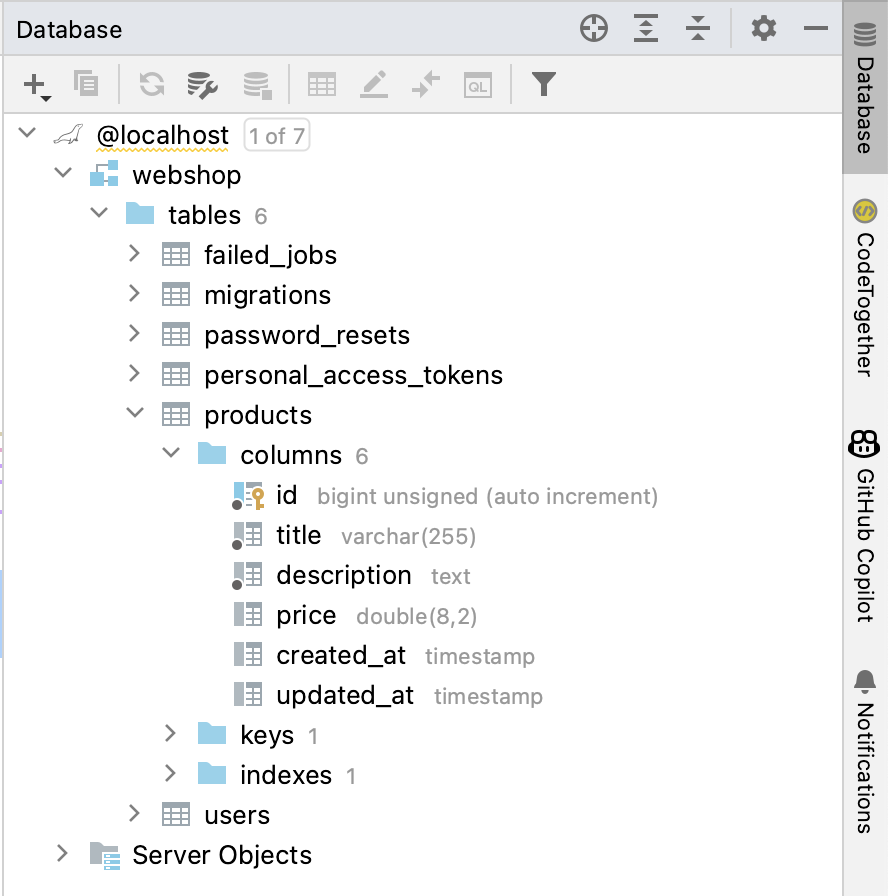

# Les 4

## Feedback

In deze praktijkles is het verstandig feedback te vragen op je User Stories, planning en ERD. Bepsreek me je docent of je gekozen aanpak een goede aanpak is voor de komende 5 weken. 

## Opdracht 1 - Model

Deze opdracht kan je meteen toepassen in je eigen project of je kunt verder gaan in het basic project waar je vorige week mee begonnen was. In deze opdracht maak je een model. De inhoud van het model zal uiteindelijk getoond worden in de View.

1. Maak een model aan voor een item dat je wilt gaan opslaan in de database. Bijvoorbeeld een Product, Movie, Reservation. Kies niet voor User, dit Model bestaat al. Voor het aanmaken van het model kan je gebruik maken van een [Artisan commando](https://laravel.com/docs/10.x/eloquent#generating-model-classes). Je kunt zelfs meteen de migration en controller creëren. 
2. Open de bijbehorende controller (bijv ProductController) en ga naar de index functie. 
3. Maak hier een nieuwe instance van het model aan en geef het model mee aan de View. 
   ```PHP
   $product = new Product();
   $product->title = 'Phone';
   $product->price = 1050;
   ```
5. Toon de onderdelen van het model in de View.


## Opdracht 2 - Migration

1. Mocht je dit niet gedaan hebben bij stap 1, [creëer dan de migration](https://laravel.com/docs/10.x/migrations#generating-migrations) zodat de bijbehorende databasetabel wordt aangemaakt. 
2. Open het aangemaakte migration bestand (in de map `database` van je project) en [voeg de velden toe](https://laravel.com/docs/10.x/migrations#creating-tables) die je nodig hebt.
3. Voer de migration uit in de terminal
   ```
   php artisan migrate
   ```
   Met de volgende regel kan je zien of er nog migrations zijn die niet uitgevoerd zijn
 
   ```
   php artisan migrate:status
   ```
 4. Vul de database met (dummy) data. Dit kan je doen door de database te openen in PHPMyAdmin of door de [database te koppelen aan PHPStorm](https://www.jetbrains.com/help/phpstorm/mariadb.html) en daar de databasetabel te openen. Deze laatste optie heeft voordelen omdat je niet naar de browser hoeft te switchen om de database in te zien. 
   
   
   [Een nieuwe rij toevoegen](https://www.jetbrains.com/help/phpstorm/table-editor.html) doe je als volgt:
   
   - Dubbelklik op de naam van de tabel om deze te openen
   - Druk op het + teken (Add Row) bovenin de balk. (Een nieuwe rij wordt toegevoegd aan de tabel)
   - Vul de benodigde informatie in (behalve de primairy key)
   - Druk op CTRL + ENTER (CMD + ENTER voor Mac) om de data definitief toe te voegen.

## Opdracht 3 - Get data and show models

1. Haal het eerste item uit de database op, op basis van het id met de [`find()`](https://laravel.com/docs/10.x/eloquent#retrieving-single-models) functie in de `show()` functie van de Controller
2. Stuur het model mee aan de View.
3. Toon de data van het opgehaalde model in de View

**Meerdere items tonen**

4. Haal [alle](https://laravel.com/docs/10.x/eloquent#retrieving-models) items op in de `index()` functie van de Controller.
5. Geef de models mee aan de View.
6. Gebruik een loop om alle models te tonen in de View.

